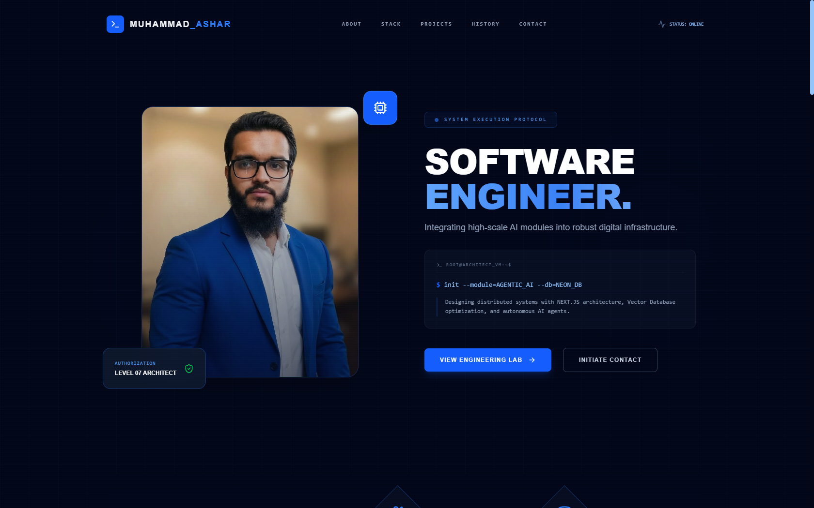
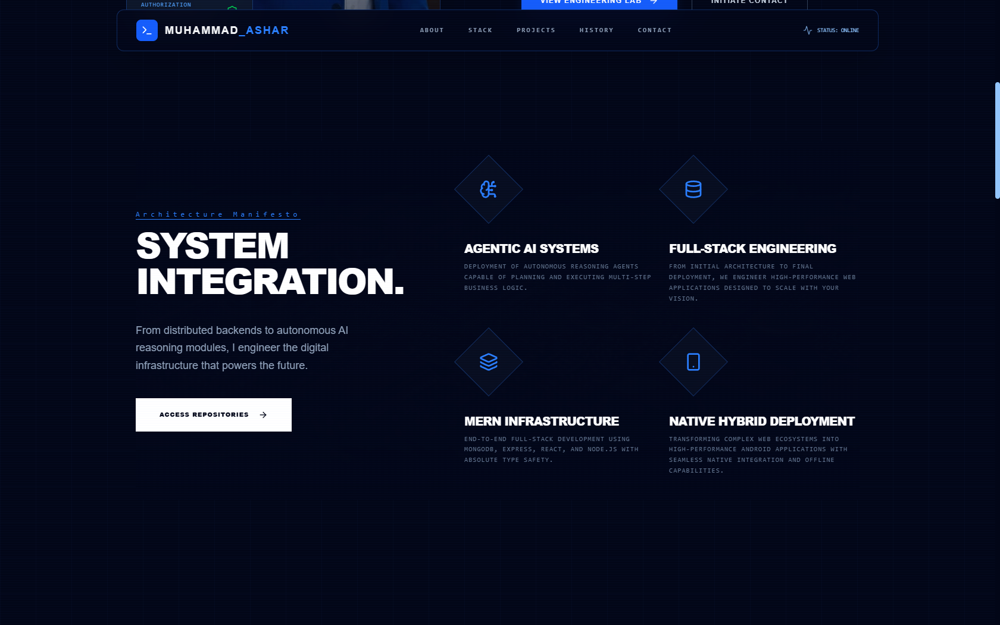
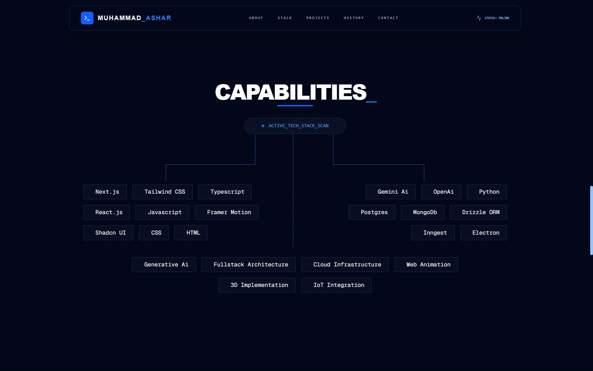
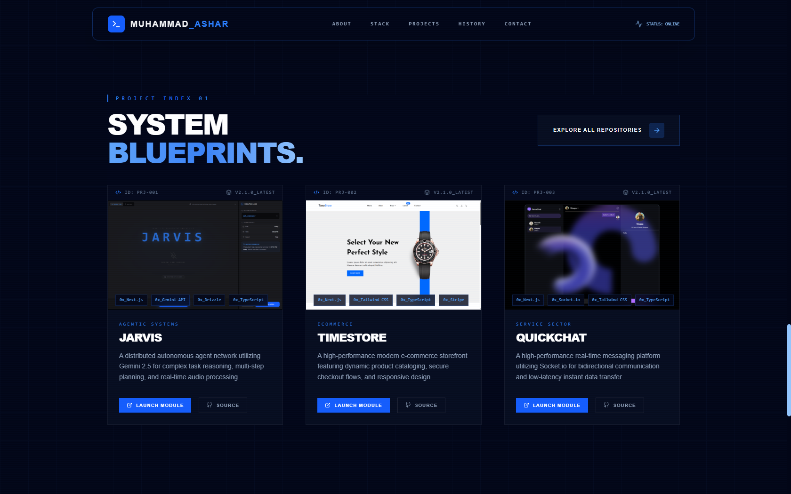

# Personal Portfolio Website

A modern, responsive personal portfolio website designed to present professional profile, skills, projects, and services in a clean and structured format.

---

## Landing Page / Hero Section

A focused introduction section that presents a clear personal identity, professional role, and provides immediate access to key actions such as exploring work and viewing the portfolio content.

---

## Services Section

This section highlights the professional services offered, providing a clear overview of capabilities and areas of expertise.

---

## Skills Section

A structured presentation of technical and professional skills, designed to give a quick understanding of expertise and strengths.

---

## Projects Section

A curated showcase of completed and featured projects, demonstrating practical experience and real-world applications.

---

## Summary

This portfolio provides a clear and organized way to present professional information, allowing visitors to quickly understand skills, services, and project experience in a visually structured layout.